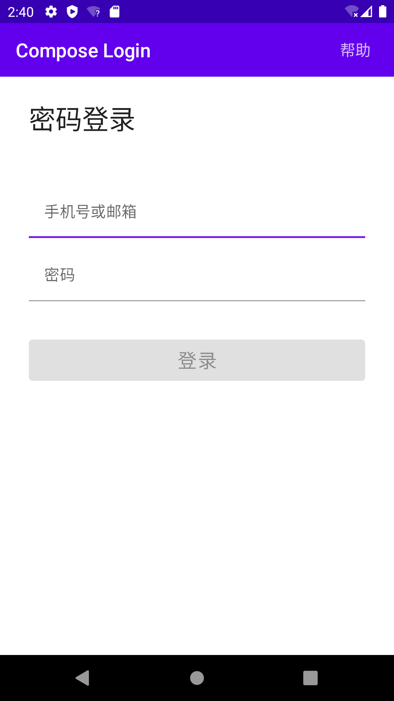
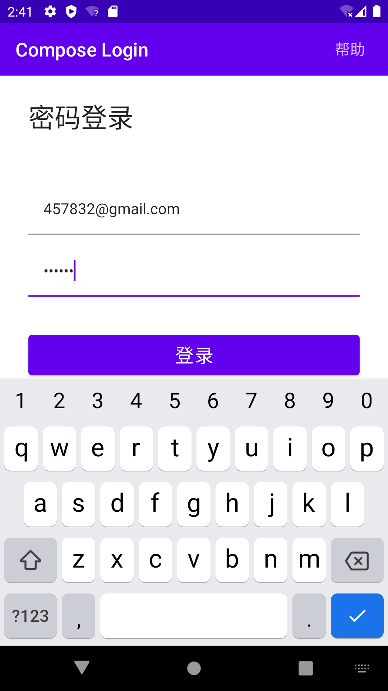
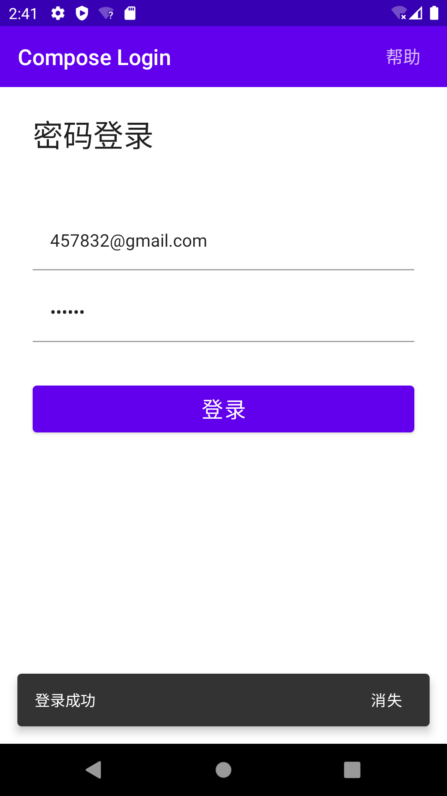

## 介绍

简单介绍一下:

主要做了一个简单的登录界面，里面有`账户`和`密码`两种类型的输入框，一个`登录按钮`，和一个`SnakeBar`。

交互：
- 账户输入框处理了onNext事件，点击软键盘next按钮，焦点移动到密码框。
- 密码输入框处理了onDone事件，点击软键盘Done按钮，焦点消失，并弹出SnakeBar。
- 登录按钮，处理了点击事件和可否点击的状态，受到点击时，清除焦点，并弹出SnakeBar.

下面是交互动态图

逐一的截图

